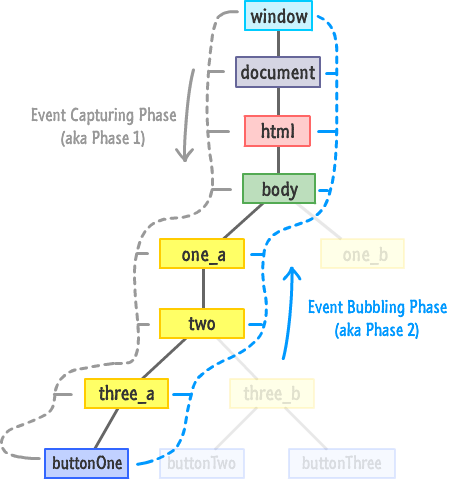

# JS интевью
1. Как работает JS **(event loop)**
2. ООП и функциональное програмирование
3. Что такое асинхронная функция, что такое промисифицированая функция
4. Высплытие **(hoisting)** переменных и функций
5. Что такое ссылочные типы данных, базовые типы данных
6. Что такое **this**, поведение в функциях. Отчличие стрелочных и обычных функций, функции генераторы
7. Что такое **pure function**
8. Замыкание, лексическое окружение, карирование
9. **ES6** модули, какие приимущества, как импортировать один модуль в другой 
::: tip
не попадает в глобальную область видимости
```javascript
export const str
import {str} from 'pathToModule'
```
:::
10. Классы, паттерны проектирования, клыссы Set и Map
* cтатические свойства классов
* super()
* getters, setters
11. Методы сбособы итерации по массивам и объектам
12. Что такое и как работает **деструктуризация**
13. Как взять уникальные элементы из массива объектов, как сделать массив уникальных элементов
14. Рекурсия и древовидная структура 
15. Остаточные параметры и параметры по умалчанию в функциях
16. **Promise**, **async await**, **Promise.all() Promise.race()**
17. Всплытие и перехват браузерных событий по **DOM**



18. Класс **FileReader**, доступ к файловой системе **JS**
19. **try catch** блок
20. Класс **Proxy**, манипуляции с функциями
21. **WebSocket api** 
22. Регулярные выражения, методы
23. Как лучше проверять тип
::: tip
**typeof**, **instanceof**, **new RegExp().constructor === RegExp**
:::
24. Как работать с url нативно - `URLSearchParams`
